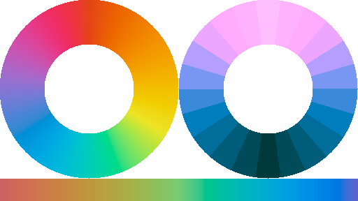

# palgrad
[](https://travis-ci.com/okaneco/palgrad)
[](https://crates.io/crates/palgrad)




`palgrad` is a command line utility that creates color gradients and palettes from user input colors.

Gradients are created in `Lch` color space (also known as `HCL`), the cylindrical representaiton of the `Lab` or `L*a*b*` color space. Using this color space, gradients are generally more vibrant and visually appealing than other spaces like `HSV` or `RGB`.

## Features

- Radial and linear continuous gradients
- Radial continuous gradients with overlay
- Radial and linear stepped gradients
- Declare colors in `Lch`, `HSV`, and `RGB`

Some ideas for using the output:
- gamut masking
- pixelization to make more color swatches
- bring into digital painting programs to color pick from as limited palettes and apply more filters
- website/application color themes

This crate uses [`palette`](https://github.com/Ogeon/palette) to handle the heavy lifting of color conversion.

## Examples

### Overlay color on radial gradient


```bash
palgrad -c -o -s 128
```
Overlay a 50% grey over the default RGB colors in `-c` with a size of 128x128 pixels. An overlay RGB color can be specified after the `-o` argument.

### Stepped radial gradient


```bash
palgrad --hsv -n 5 -s 128 -r 0.25
```
Use the default HSV colors `--hsv`, 5 steps between the colors, size of 128x128, and inner radius factor of `-r 0.25`.

### Stepped linear gradient


```bash
palgrad -l -d -n 8 --ss 30x20
```
Make a linear gradient `-l` with the default RGB decimal colors `-d`, 8 steps between the two colors, and the swatch sizes are 30x20 pixels each. To make a continuous gradient, omit the steps argument `-n`.


## License

This crate is licensed under either
- the [MIT License](LICENSE-MIT), or
- the [Apache License (Version 2.0)](LICENSE-APACHE)

at your option.
